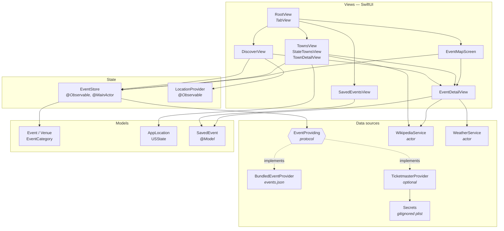
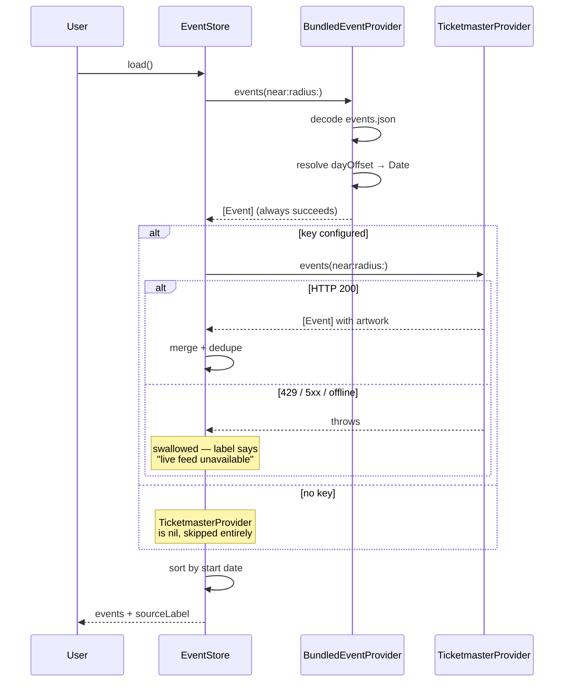
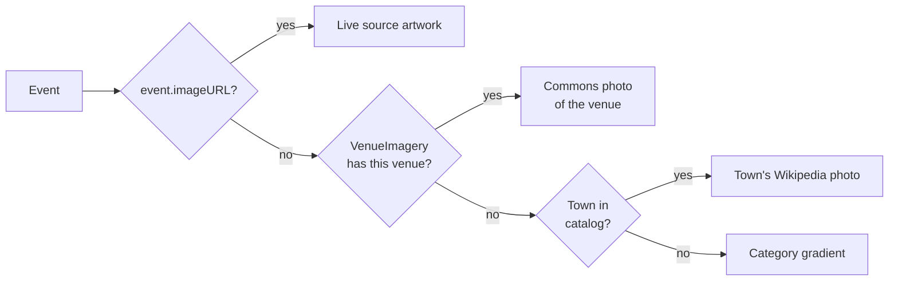
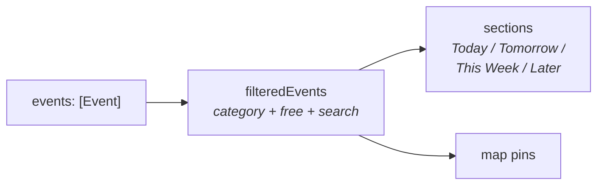
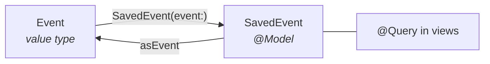
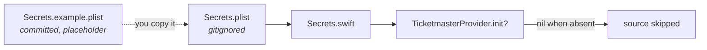

# VT2NH — System Architecture

How the app is put together, and why it is put together that way.

The governing constraint is that **every data source is free and most require no
key**. That is not a cost decision so much as a reliability one: the previous
version of this app depended on a single gated API, that API closed, and the app
died with it. The design below assumes any given source can vanish and makes
sure the app still works when one does.

---

## 1. Layers

**Dependency rule:** views depend on state, state depends on protocols, nothing
depends on a specific vendor. `EventStore` has no idea Ticketmaster exists — it
holds an array of `EventProviding`. Swapping in a different feed touches one file.

---

## 2. Event loading

Two sources, merged. One is guaranteed, one is optional.

**Why the bundled feed exists.** A recruiter cloning this repo gets a fully
working app with no signup step. It is also the floor that makes live-source
failure a non-event rather than an empty screen.

**Why day offsets.** `events.json` stores `dayOffset: 3` rather than a date. The
provider resolves offsets against *today* at load. A demo opened a year from now
still shows a full week of upcoming events instead of a dead calendar.

**Dedupe.** Both sources can describe the same show. The key is
`lowercased(name) + startOfDay(start)` — same show, same day, one row.

---

## 3. Image resolution

Three fallbacks, most-specific first. Every step can fail without breaking the UI.

`VenueImagery` is a hand-checked list of ten venues, and it is short on purpose.
Two automated approaches were built and thrown away:

| Approach | Result |
|---|---|
| Commons **name search** | Stowe's recreation path → a recreation area in England. Concord's White Park → a park in Australia. SNHU Arena → a political rally. |
| Commons **geosearch** (radius + name check) | Much more accurate, but matched only 6 of 105 venues, and still gave the Brattleboro museum a nearby oil-change shop. |

Coverage was traded for correctness: showing the wrong place is worse than
showing the right town.

Town photos have their own fallback — Wikipedia's lead image for a small village
is often a county locator map, so those are detected (`.svg`, `locator`,
`highlighted`, `_map` in the URL) and replaced with a curated Commons file.

---

## 4. State and observation

`EventStore` is `@Observable`, not `ObservableObject`. SwiftUI then tracks only
the properties a given view actually reads:

- Typing in Discover's search field mutates `searchText` → the list re-renders,
  **the map does not**.
- Changing `selectedTown` triggers a reload and moves the map camera.

Both Discover and Map read the *same* store instance, created once in
`RootView`, so filters can never disagree between tabs.

---

## 5. Concurrency

| Type | Isolation | Reason |
|---|---|---|
| `EventStore` | `@MainActor` | Drives UI directly; no hop needed on mutation |
| `LocationProvider` | `@MainActor` + `nonisolated` delegate | `CLLocationManagerDelegate` callbacks arrive off-main and hop back |
| `WikipediaService` | `actor` | Serializes a shared photo/profile cache |
| `WeatherService` | `actor` | Serializes a forecast cache keyed by coordinate + day |
| Providers | `Sendable` structs | Stateless; safe to call from anywhere |

Caches are actor state rather than a lock. Scrolling a list of 105 events issues
one network call per distinct town, not per row.

---

## 6. Persistence

SwiftData, replacing the previous Core Data stack and roughly 150 lines of
container/context boilerplate.

`@Attribute(.unique)` on `eventID` is what makes double-saving impossible — the
old version appended a duplicate row on every tap. Views read through `@Query`,
so saving on the detail screen updates the Saved tab's badge with no manual
refresh anywhere.

---

## 7. Degradation

The app never shows an error screen for a source failure. Each one narrows the
experience instead.

| Condition | Effect |
|---|---|
| No Ticketmaster key | Bundled feed only; live source never constructed |
| Ticketmaster rate-limited or down | Bundled feed only; footer notes it |
| No network at all | Full event list, gradient art, no forecasts, no town photos |
| Event > 16 days out | Forecast row omitted rather than guessed |
| Location denied | "Near me" unavailable; every other feature unaffected |
| Wikipedia unreachable | Tinted gradient placeholders; layout unchanged |

---

## 8. Secrets

`init?` returning nil when no key is present is what makes a missing key a
non-error. The previous version hardcoded a Facebook token in source and pushed
it to a public repo; that history has since been rewritten and the token purged.

---

## 9. Extending it

| Goal | Where |
|---|---|
| Add an event source | New type conforming to `EventProviding`; register in `EventStore` |
| Add a town | One entry in `LocationCatalog`; pull coordinates from its Wikipedia article |
| Add a category | Add a case to `EventCategory`; `title`/`symbol`/tint are exhaustive switches, so the compiler finds every site |
| Add events | Append to `events.json` using day offsets |
| Add a venue photo | One verified entry in `VenueImagery` |
